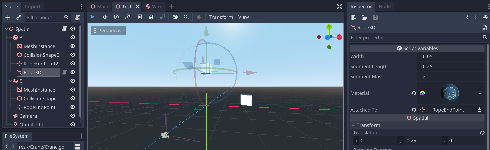

# Rope3D

WORK IN PROGRESS!!

A simple 3D rope plugin for Godot 3.x.

## How to use?

Add a rope node and connect it to another node. Currently BOTH need to be (grand)children of a Physics Body. Tweak width, mass and segment lengths so that it looks and feels good.

